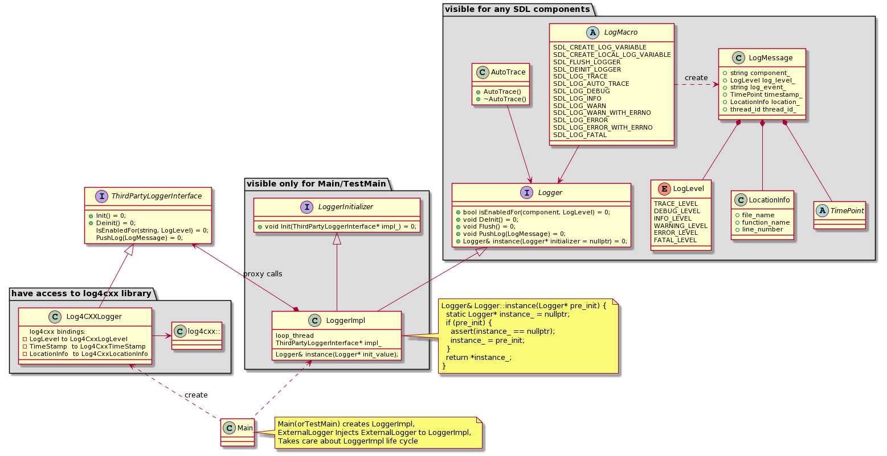

# SDL Logger

Open source version of SDL is using log4cxx for logging.
Because of lack of log4cxx stability OEM should have an ability to replace log4cxx logger with any other logging boost or syslog.


SDL implements Logger abstration for easily replacement of logging library.

|||
High Level Design

|||


All components have aceess to `Logger` interface and use it for logging.

## SDLLogger

`Logger` interface is implemented by `SDLLoggerImpl`. 

`SDLLoggerImpl` use message loop thread to proxy log messages to third party (external) logger.
`SDLLoggerImpl` owns `ExternalLogger` and controls it's lifetime. 
`SDLLoggerImpl` provides implementation of the singleton pattern.


### Message loop thread in SDLLogger

Message loop thread is needed to avoid significant performance degradation in run time as logging calls are blocking calls and might take too much time. 
`SDLLoggerImpl::PushLog` is non a blocking call. It will put the log message into the queue and returns immediately 


If `ExternalLogger` supports non blocking threaded logging, minor changes in `SDLLogger` are required : `SDLLoggerImpl::PushLog` should be reimplemented to 
use `ExternalLogger::ForceLog()` directly. 

## Logger singleton 

Logger is the only one singleton class in SDL.
Singleton pattern required to have an access to logger from any component. 
Logger singleton provides singleton by `Logger` interface. 
So sdl components do not have information about neither logger implementation nor specific external logger. 

## Logger singleton with plugins 

SDL plugins are shared libraries, so `LoggerSingleton` could not be implemented with Mayers singleton. 
Mayers singleton would create own SDL logger instance.

The idea is to pass singleton pointer to Plugin during creation, so that plugin could initialize `Logger::instance` pointer with one received from SDL core. 


Instance implementation : 
```cpp
static Logger& instance(Logger* pre_init = nullptr);

Logger& Logger::instance(Logger* pre_init) {
  static Logger* instance_ = nullptr;
  if (pre_init) {
    assert(instance_ == nullptr);
    instance_ = pre_init;
  }
  assert(instance_);
  return *instance_;
}
```

`pre_init` is `nullptr` by default, so all components will access instance_ static pointer for logging. 
`main()`  function need to create `SDLLogger` implementation and call `Logger::instance` (logger implementation);

Plugin implementation:
```cpp 
extern "C" PluginType* Create(Logger* logger_singleton_instance) {
  Logger::instance(logger_instance);
  return new PluginType();
}
```

SDL Core part will give pointer to logger singleton to the plugin so that plugin shared lib could initialize `Logger::instance` with the same pointer as core part. 

## Logger detailed design :

Each component creates `logger_` variable via macro. 
This variable is actually a string with component name of the logger.
Some logger implementations (like log4cxx) may have separate suverity or destanation  rules for each component. 

Logger macroses used to create such variable in each source file where logging is required.

SDL implements all info required for log message :

 * LogLevel enum
 * Location info struct : location in the code
 * TimePoint 


|||
Detailed Design

|||


### Logger interface 

Logger macroses use Logger interface for sending messages to External Logger. 
Logger interface contains only methods required by any SDL component to perform logging : 

 * PushLog(LogMessage)
 * IsEnabledFor(LogLevel)
 * Enabled()
 * instance() - singleton


### LoggerInitializer interface 

LoggerInitializer specify interface required for Main to init/deinit logger but not required for any other SDL components
LoggerInitializer should be templated with paticular ExternalLogger implementation

It contains : 
 - Init(ExternalLogger* external_logger)
 - DeInit()

Init and DeInit should perform internal initialization/deinitializetion and be proxied to ExternalLogger

### ThirdPartyLogger interface

ThirdPartyLogger interface extends Logger Interface with Initialization and deinitialization methods

This interface should be inherited by particular external logger implementation 


## Another logger implementation. 


To use another (not log4cxx) logger, you should implement ThirdPartyLoggerInterface class 

```cpp
AnotherOneLoggerImpl : ThirdPartyLoggerInterface {
  void SomeCustomMethod(parameters);
  void Init() override;
  void DeInit() override;
  void Enable() override;
  bool Enabled() override;
  void Disable() override;
  void Flush() override;
  void PushLog(const LogMessage& log_message) override;
}
```

Then you should create `AnotherOneLoggerImpl` in main and setup it for `SDLLoggerImpl` :
```cpp
// main.cpp
int main(argc, argv) {
	auto external_logger_ = std::make_unique<AnotherOneLoggerImpl>();
	external_logger_->SomeCustomMethod(argv);
	auto sdl_logger_instance_ = std::make_unique<SDLLoggerImpl<AnotherOneLoggerImpl>>();
	sdl_logger_instance_->Init(std::move(external_logger_));
	Logger::instance(std::move(sdl_logger_instance_));  

	// Any other application code
}

```
