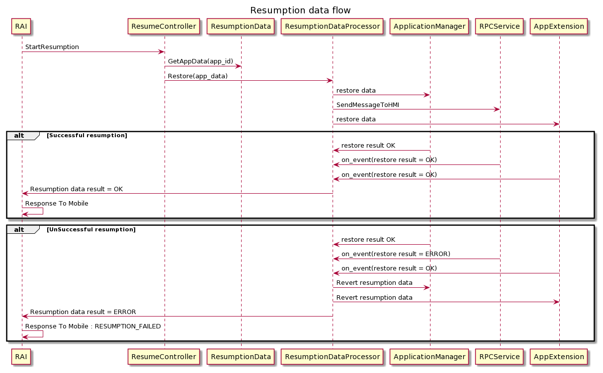
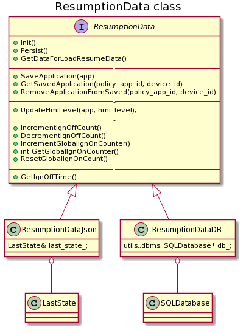

# Resume Controller

This page will descrive internal structure and detailed design of Resume controller 

|||
Figure 1: ResumeController Overview

|||

!!! NOTE
Classes named like *Impl only _represent_ implementations of the abstract sub classes and may not be named the same in the SDL Core project.
UML Refresher
* Aggregation: Solid line with open diamond
* Composition: Solid line with filled diamond
* Inheritance: Dotted line with open arrow
* Dependency: Dotted line with two prong arrow
!!!

## Resume Controller


Resume controller responcibiity is to cover Resumption requirenments of SDL.
There are 2 resumption types : 
 * HMI state resumption
 * Data Resumption 

Resume controller do both.  


### HMI state resumption 

In case of unexpected disconnect SDL should store application hmi state next 3 ignition cycles.
On next application registration SDL should restore last saved application hmi_state.

ResumptionData interface contains responcible for keeping application information. 
ResumeCtrlImpl is responsible for HMI state restoring. 

ResumeCtrlImpl will remove application hmi_state info from resumption data after 3 ignition cycles. 
On each shutdown ResumeCtrlImpl will increment `ign_off_count` value for each application.

On App registration `ResumeCtrl::StartResumptionOnlyHMILevel` or `ResumeCtrlImpl::StartResumption` will put aplication in a queue for resumption. 
Internal timer in ResumeCtrlImpl will restore application hmi_state in several seconds (configured by `ApplicationManagerSettings::app_resuming_timeout`)
In case if any  other application already registered, StateController will take care about hmi_states conflicts resolving. 


### Data resumption

SDL restores application data if application sends appropriate `hash` in the RAI. Hash updates after each data change. 
SDL stores resumption data either in json or in database, this option is configurable. 

ResumeControllerImpl requests app data from `ResumptionData` class and provides it to `ResumptionDataProcessor`

`ResumptionDataProcessor` is responsible for restoring application data and provides the result to RAI via callback

|||
Figure 2: Resumption data seauence Overview

|||


### ResumptionData

`ResumptionData` class is used to represent resumption data agnostic to data storage. 
`ResumptionData` provides app resumption data in the Smart Object representation. 

|||
Figure 2: Resumption data classes

|||

There are 2 implementations of resumption data : 
 * `ResumptionDataJson`
 * `ResumptionDataDB`

 `ResumptionData` does not contain active components : timers, reactions, callbacks, etc ...
 It behaves like data a storage.

### ResumptionDataProcessor

`ResumptionDataProcessor` is responsible for restoring resumption data and tracking its status. 

Main public function for resumptions is `ResumptionDataProcessor::Restore` : 
```cpp
  /**
  * @brief Running resumption data process from saved_app to application.
  * @param application application which will be resumed
  * @param saved_app application specific section from backup file
  */
  void Restore(app_mngr::ApplicationSharedPtr application,
               smart_objects::SmartObject& saved_app,
               ResumeCtrl::ResumptionCallBack callback);
```

`ResumeCtrl::ResumptionCallBack callback` is a function that should be called after data resumption : 
```cpp
typedef std::function<void(mobile_apis::Result::eType result_code,
                             const std::string& info)> ResumptionCallBack;
```

Some resumption data should be restored in the `Application` class itself.
Some resumption data should be stored in plugins : ApplicationExtensions. 
Some resumption data requires sending HMI request. 

`ResumptionDataProcessor` is inherited from `EventObserver` to track responses. 

If responses are successful `ResumptionDataProcessor` just call `callback(SUCCESS)`

If part of the data was failed to restore, `ResumptionDataProcessor` should revert already restored data and call  `callback(ERROR_CODE, info)`.

Requirenments available in proposal [Handle response from HMI during resumption data](https://github.com/smartdevicelink/sdl_evolution/blob/master/proposals/0190-resumption-data-error-handling.md)

RAI will wait for callback to send response to a mobile application.

### AppExtension

Application extension contains follwowing methods for resumption : 
```cpp
  /**
   * @brief SaveResumptionData method called by SDL when it saves resumption
   * data.
   * @param resumption_data data reference to data, that will be appended by
   * plugin
   */
  virtual void SaveResumptionData(
      smart_objects::SmartObject& resumption_data) = 0;

  /**
   * @brief ProcessResumption Method called by SDL during resumption.
   * @param resumption_data list of resumption data
   * @param subscriber callbacks for subscribing
   */
  virtual void ProcessResumption(
      const smart_objects::SmartObject& resumption_data,
      resumption::Subscriber subscriber) = 0;

  /**
   * @brief RevertResumption Method called by SDL during revert resumption.
   * @param subscriptions Subscriptions from which must discard
   */
  virtual void RevertResumption(
      const smart_objects::SmartObject& subscriptions) = 0;
```

Only app extension have an access to active data, data send and data revert process. 
Each app extension use own plugin to manipulate with functionality. 

`SaveResumptionData` will fill passwd resumption_data for saving to `ResumptionData`. 

|||
Example from VehicleInfoAppExtension: 
```cpp
SDLRPCPlugin& plugin_;
...
void VehicleInfoAppExtension::SaveResumptionData(
    smart_objects::SmartObject& resumption_data) {
  resumption_data[strings::application_vehicle_info] =
      smart_objects::SmartObject(smart_objects::SmartType_Array);
  int i = 0;
  for (const auto& subscription : subscribed_data_) {
    resumption_data[strings::application_vehicle_info][i++] = subscription;
  }
}
```
|||

`ProcessResumption` will send appropriate hmi requests, and change internal SDL state according to provided `resumption_data`. All HMI responses will be transfered to `subscriber`. 

|||
Example from SDLAppExtension: 
```cpp
SDLRPCPlugin& plugin_;
...
void SDLAppExtension::ProcessResumption(
    const smart_objects::SmartObject& saved_app,
    resumption::Subscriber subscriber) {
  ...
  const bool subscribed_for_way_points_so =
      saved_app[strings::subscribed_for_way_points].asBool();
  if (subscribed_for_way_points_so) {
    plugin_.ProcessResumptionSubscription(app_, *this, subscriber);
  }
}
```
|||

`RevertResumption` will send appropriate hmi requests to revert provided `subscriptions`.


`ResumptionDataProcessor` go throw all `application->Extensions` to track responses and setup itself as `subscriber` : 

```cpp
void ResumptionDataProcessor::AddPluginsSubscriptions(
    ApplicationSharedPtr application,
    const smart_objects::SmartObject& saved_app) {
  LOG4CXX_AUTO_TRACE(logger_);

  for (auto& extension : application->Extensions()) {
    extension->ProcessResumption(
        saved_app,
        [this](const int32_t app_id, const ResumptionRequest request) {
          this->WaitForResponse(app_id, request);
        });
  }
}
```
