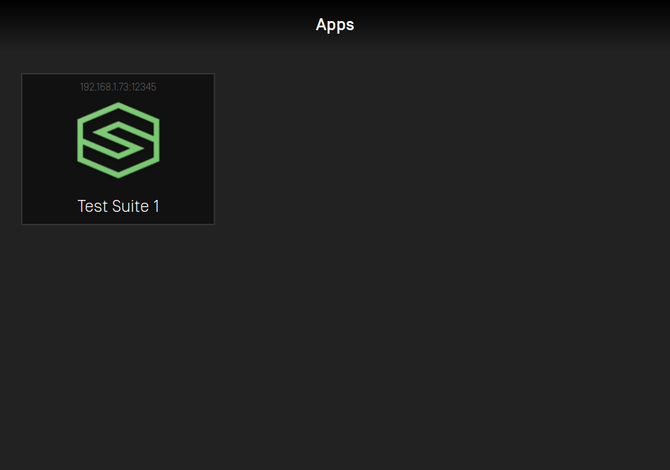
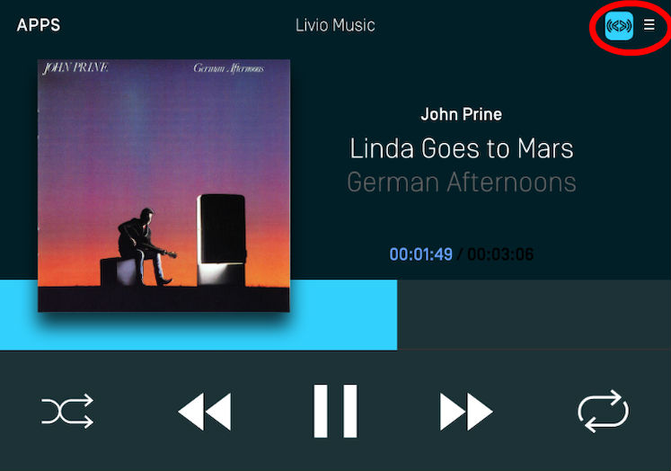
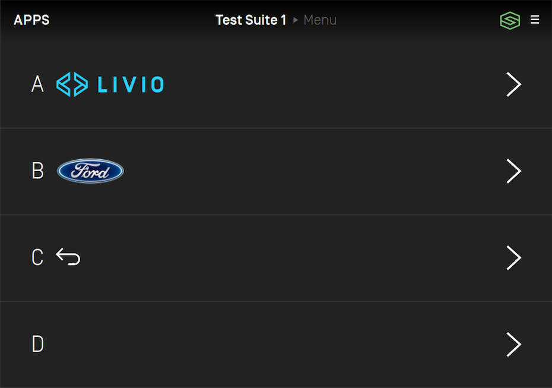
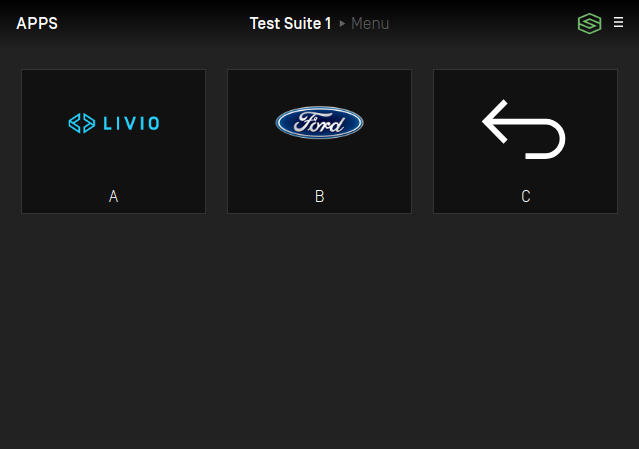
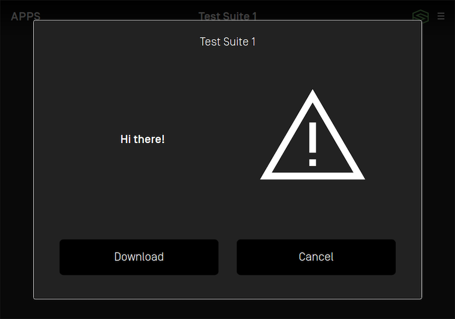
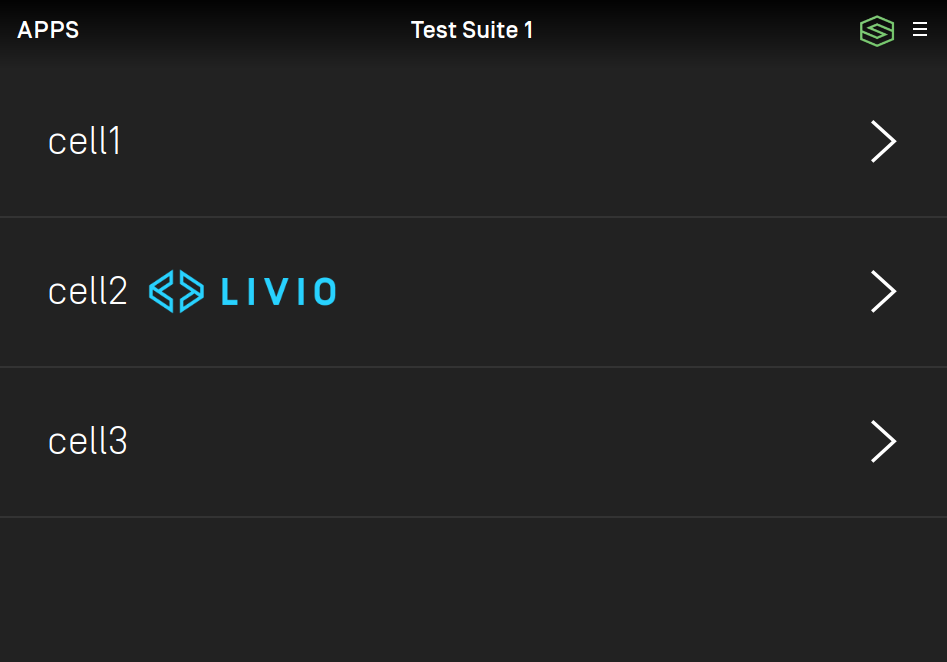
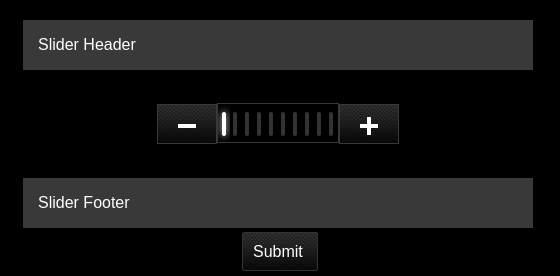
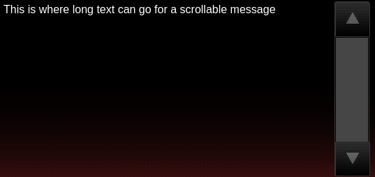

# Creating the HMI UI

Before starting the development of the SDL HMI user interface, there are a few RPC prerequisites that are required.

The minimum prerequisites to connect your SDL compatible user interface are:

1. Establish an HMI websocket connection to SDL Core.
2. Register the following components: BasicCommunication, Buttons, and UI.
3. Send the `BasicCommunication.OnReady` notification to SDL Core.
4. Respond to the `IsReady` request for each registered component.
5. Subscribe to the following Core notifications: 
    - `BasicCommunication.OnAppRegistered`
    - `BasicCommunication.OnAppUnregistered`
    - `BasicCommunication.OnPutFile`
    - `Buttons.OnButtonSubscription`

## Creating the App List

When there are changes to the list of registered apps, Core will send a `BasicCommunication.UpdateAppList` RPC request to the HMI. This request contains an array of information for all connected and pending applications. The HMI should use the information provided in this request to update its internal app list state and app list display.

For each app listed in the `UpdateAppList` request, the HMI's app list view should show a button that includes the app's name and icon.



If an app is disconnected or unregistered, Core will send an `UpdateAppList` request to the HMI with that application omitted from the app list array. The HMI should make sure its app list is always up to date, and only show applications that were included in the most recent `UpdateAppList` request.

## Activating an Application

### User Selection

When the user selects an application from the app list, a request should be made to bring this app to the foreground (this is called "activating" the application). The first step required by the HMI when an application is selected is to send a `SDL.ActivateApp` request to Core. When Core responds with a successful `SDL.ActivateApp` response, the HMI can switch views from the app list to the app's default template.

!!! NOTE
The default template for an app should be used if the app has not requested to use a specific template via the `UI.Show.templateConfiguration` parameter or `UI.SetDisplayLayout` RPC (deprecated).

The default template for media apps is `MEDIA`, and the default template for all other apps is `NON-MEDIA`.

You can check if a given app is a media application using that app's `isMediaApplication` parameter, sent in the `BasicCommunication.UpdateAppList` request.
!!!

### User Consent

If the `SDL.ActivateApp` response returns with the parameter `isPermissionsConsentNeeded = true`, the HMI should send a `SDL.GetListOfPermissions` request. This happens when the activating app requires permissions that the user must provide consent for. For example, if an app wants to access vehicle data, an SDL policy configuration might require the user to provide consent before the app can collect this information.

After receiving the list of permissions for the app, the HMI should show the user the `PermissionItem` name and status for each requested permission. If available, the HMI should also show a consent prompt that contains a user friendly message describing what the user is agreeing to. The user should have the ability to enable or disable each permission item. If any permission changes are made by the user, these updates should be communicated to Core via the `SDL.OnAppPermissionConsent` notification.

!!! NOTE
Permissions are managed by SDL Core's policy table. Refer to the [SDL Overview Policy Guide](https://smartdevicelink.com/en/guides/sdl-overview-guides/policies/overview/).

[OEM defined consent prompts](https://smartdevicelink.com/en/guides/sdl-overview-guides/policies/policy-fields/#consumer-friendly-messages) can be retrieved from the policy table via a `BasicCommunication.GetUserFriendlyMessage` RPC.
!!!

### Resumption

If an app is disconnected from SDL Core and reconnects within a specified time limit, Core will try to resume the app into the same HMI state the app was in before it was disconnected. The HMI should be prepared to handle a `BasicCommunication.ActivateApp` request from SDL Core, in which case the HMI should return the app into the requested state (or respond with an error if unable to). For example, if the requested HMI level is `FULL`, the HMI should activate the app and put that app's template into view.

!!! NOTE
`BasicCommunication.ActivateApp` is used differently than the previously described `SDL.ActivateApp`, but the two can be easily confused.

`SDL.ActivateApp` is a request originating from the HMI and should be sent when the user selects an app to activate.

`BasicCommunication.ActivateApp` is a request originating from SDL Core to move an app into a specific state. It is generally received by the HMI during app resumption.
!!!

## Displaying Information

When an app wants to display information on the head unit, the HMI will receive a `UI.Show` request. The `UI.Show` request provides the HMI with the text, soft button information, and images an app has requested to display. The HMI should store the information in these requests for when an app is activated and put into full. `UI.Show` requests are not always sent when an app is activated and in view.

!!! NOTE

The HMI should merge the information in `UI.Show` requests with existing show information received for an app. 

For example, if the HMI receives a request with the text parameter `mainfield1` and a second request with the text parameter `mainfield2`, the HMI should display both `mainfield1` and `mainfield2`.

If an app wants to clear a text field that it sent in a previous `UI.Show` request, SDL Core will send the HMI a request with that parameter's value set to an empty string ("").

!!!

## Implementing Soft Buttons

A `Softbutton` received from a `UI.Show` request should be displayed when the app is displaying a template. A template can have a max of 8 `Softbuttons`. These buttons can be of type `TEXT`, `IMAGE`, or `BOTH`.

The HMI should keep an internal state of `SoftButtons` received by `UI.Show` requests, similar to how text fields and graphics are stored. Each `SoftButton` has a unique ID which must be saved by the HMI. These IDs are used in any messages sent to SDL Core when a user interacts with a `SoftButton`.

The actions expected of the HMI when the user selects a `SoftButton` are:

 - HMI sends a notification `UI.OnButtonEvent` with buttonEventMode = `DOWN` when the user presses a button.
 - HMI sends a notification `UI.OnButtonEvent` with buttonEventMode = `UP` when the user releases a button.
 - HMI sends a notification `UI.OnButtonPress` with buttonPressMode = `SHORT` or `LONG`, depending on how long the user holds the button in a down state.

!!! NOTE
Not all HMIs support the ability to detect a button press duration, or differentiate between an up and down button event. In this case the HMI should make sure its ButtonCapabilities are accurately sent to Core via the `ButtonCapabilities` parameter in `UI.GetCapabilities`. 

[More on HMI capabilities](#defining-the-ui-capabilities).
!!!

## Switching Templates

SDL Core can request the HMI to change an app's template using a `UI.Show` request, or the deprecated RPC `UI.SetDisplayLayout`.

In order to specify the template to be displayed, the `UI.Show` request uses the `templateConfiguration` parameter, which includes a string for the requested layout.

For `UI.SetDisplayLayout`, the `displayLayout` string parameter is used for the same purpose.

Using `UI.Show` is the preferred method because the request can be used to change the layout of the screen and the screen contents in a single request. This helps prevent lag and screen flashing when an app wants to change an app template.

An SDL app should only request to view templates that are supported in the HMI Capabilities. The HMI may return a failed response to Core in the event an unsupported template is requested. 

[More on HMI capabilities](#defining-the-ui-capabilities).

## Supported Template Views

A reference list for all supported template views can be found [here](https://smartdevicelink.com/en/guides/sdl-overview-guides/user-interface/supported-templates/). This list shows screenshots of the 15 supported template views and how their text, graphic, and soft button components are arranged.

The defined strings for each template can be found in the `PredefinedLayout` struct in the Mobile API RPC Specification. 

## Creating the App Menu

Each application is able to maintain a list of menu commands through SDL. This in-app menu should be made accessible from an app's template view. Please note the example placement of the menu icon in the top right of the screenshot below.



!!! NOTE
If the user chooses to open the menu, the HMI must send a `UI.OnSystemContext` notification with the `SystemContext` enum: `MENU`. After the user exits the menu, another `UI.OnSystemContext` notification must be sent with the `SystemContext` value: `MAIN`.
!!!

The contents of the app's menu are populated by the RPC `UI.AddCommand`. Each `UI.AddCommand` received corresponds to an individual menu item. When the user selects a menu item via the UI, the HMI should send a `UI.OnCommand` notification. It is best practice to exit the menu after a user makes a selection from the list of commands.

There are some minor customization options available for the app menu. An HMI can choose to implement the app menu in a tile view, list view, or both. If an app has a preference for a type of menu layout, the HMI will receive a `UI.SetGlobalProperties` request from SDL Core containing this preference in the `menuLayout` field.

#### List Menu Example



#### Tiles Menu Example



## Implementing Popups

There are several RPCs which are used to display a popup or an overlay to the user.

### UI.Alert

`Alert` is used to display a simple popup that can contain an image, text, and buttons.



### UI.PerformInteraction

`PerformInteraction` is used to display a popup with contents which are displayed in a similar way to the app menu.



### UI.Slider

`Slider` is used to display a popup that allows the user to enter a value via a slider input.



### UI.ScrollableMessage

`ScrollableMessage` is used to display a popup which shows a long message to the user that requires scrolling.



!!! NOTE

It is important that the HMI sends SDL Core a `UI.OnSystemContext` notification when displaying and closing a popup. A `systemContext` value of `ALERT` is used when `UI.Alert` is active, `HMI_OBSCURED` is used for all other popups.

!!!

## Navigating Through the IVI

It is common for an SDL UI to be integrated into an existing OEM's UI. In order for SDL Core to work well with a head unit that has other embedded components, the HMI should make use of the `BasicCommunication.OnEventChanged` notification. This notification allows connected SDL applications to receive updates about their HMI status when a user interacts with other components like the embedded navigation or radio.

For example, if an SDL media application is active and is playing audio, then the user switches the audio source to the embedded radio, the HMI should send SDL Core a `BasicCommunication.OnEventChanged` notification with `eventName = AUDIO_SOURCE` and `isActive = true`. This HMI notification will let the media application know that it no longer has control of the audio source.

If the user selects the media app as the audio source again, the HMI should send the same `BasicCommunication.OnEventChanged` notification, but with `isActive = false`. This will indicate to SDL Core that the application has regained control of the audio.

## Defining the UI Capabilities

There are several ways that the HMI should communicate its UI capabilities to SDL Core. When first connecting the HMI to SDL Core, SDL Core will send a `UI.GetCapabilities` request (a similar GetCapabilities request is sent for every interface). The HMI's response should include accurate information relating to its supported display capabilities, audio pass through capabilities, soft button capabilities, and various other system capabilities (See [UI.GetCapabilities](https://smartdevicelink.com/en/guides/hmi/ui/getcapabilities/#parameters_1)).

It is likely that the UI capabilities will be different for each template view, therefore it is important for the HMI to send updates about its capabilities to SDL Core. For example, if an app requests a new template configuration, after switching to that view the HMI must send an `OnSystemCapabilityUpdated` notification for `"systemCapabilityType": "DISPLAYS"`.

!!! NOTE
Even though `UI.SetDisplayLayout` is deprecated, the HMI can still receive requests to change layouts from this RPC from older applications. It is important that the response for `UI.SetDisplayLayout` includes accurate display capabilities for the new layout as well.
!!!

As an example, if SDL Core requests to change the layout to the `MEDIA` template, the `OnSystemCapabilitiesUpdated` notification parameters may look something like this (taken from the [Generic HMI](https://github.com/smartdevicelink/generic_hmi)):
```JSON
{
  "appID":"1234",
  "systemCapability":{
    "systemCapabilityType":"DISPLAYS",
    "displayCapabilities":{
      "displayName":"GENERIC_HMI",
      "windowTypeSupported":[
        {
          "type":"MAIN",
          "maximumNumberOfWindows":1
        }
      ],
      "windowCapabilities":[
        {
          "windowID":0,
          "textFields":[
            {
              "name":"mainField1",
              "characterSet":"TYPE2SET",
              "width":500,
              "rows":1
            },
            {
              "name":"mainField2",
              "characterSet":"TYPE2SET",
              "width":500,
              "rows":1
            },
            {
              "name":"mainField3",
              "characterSet":"TYPE2SET",
              "width":500,
              "rows":1
            },
            {
              "name":"statusBar",
              "characterSet":"TYPE2SET",
              "width":500,
              "rows":1
            },
            {
              "name":"mediaClock",
              "characterSet":"TYPE2SET",
              "width":500,
              "rows":1
            },
            {
              "name":"mediaTrack",
              "characterSet":"TYPE2SET",
              "width":500,
              "rows":1
            },
            {
              "name":"templateTitle",
              "characterSet":"TYPE2SET",
              "width":50,
              "rows":1
            },
            {
              "name":"alertText1",
              "characterSet":"TYPE2SET",
              "width":500,
              "rows":1
            },
            {
              "name":"alertText2",
              "characterSet":"TYPE2SET",
              "width":500,
              "rows":1
            },
            {
              "name":"alertText3",
              "characterSet":"TYPE2SET",
              "width":500,
              "rows":1
            },
            {
              "name":"menuName",
              "characterSet":"TYPE2SET",
              "width":500,
              "rows":1
            },
            {
              "name":"secondaryText",
              "characterSet":"TYPE2SET",
              "width":500,
              "rows":1
            },
            {
              "name":"tertiaryText",
              "characterSet":"TYPE2SET",
              "width":500,
              "rows":1
            },
            {
              "name":"menuTitle",
              "characterSet":"TYPE2SET",
              "width":500,
              "rows":1
            }
          ],
          "imageFields":[
            {
              "name":"choiceImage",
              "imageTypeSupported":[
                "GRAPHIC_PNG"
              ],
              "imageResolution":{
                "resolutionWidth":40,
                "resolutionHeight":40
              }
            },
            {
              "name":"softButtonImage",
              "imageTypeSupported":[
                "GRAPHIC_PNG"
              ],
              "imageResolution":{
                "resolutionWidth":50,
                "resolutionHeight":50
              }
            },
            {
              "name":"softButtonImage",
              "imageTypeSupported":[
                "GRAPHIC_PNG"
              ],
              "imageResolution":{
                "resolutionWidth":50,
                "resolutionHeight":50
              }
            },
            {
              "name":"menuIcon",
              "imageTypeSupported":[
                "GRAPHIC_PNG"
              ],
              "imageResolution":{
                "resolutionWidth":40,
                "resolutionHeight":40
              }
            },
            {
              "name":"cmdIcon",
              "imageTypeSupported":[
                "GRAPHIC_PNG"
              ],
              "imageResolution":{
                "resolutionWidth":150,
                "resolutionHeight":150
              }
            },
            {
              "name":"appIcon",
              "imageTypeSupported":[
                "GRAPHIC_PNG"
              ],
              "imageResolution":{
                "resolutionWidth":50,
                "resolutionHeight":50
              }
            },
            {
              "name":"graphic",
              "imageTypeSupported":[
                "GRAPHIC_PNG"
              ],
              "imageResolution":{
                "resolutionWidth":360,
                "resolutionHeight":360
              }
            },
            {
              "name":"alertIcon",
              "imageTypeSupported":[
                "GRAPHIC_PNG"
              ],
              "imageResolution":{
                "resolutionWidth":225,
                "resolutionHeight":225
              }
            }
          ],
          "imageTypeSupported":[
            "DYNAMIC",
            "STATIC"
          ],
          "templatesAvailable":[
            "DEFAULT",
            "MEDIA",
            "NON-MEDIA",
            "LARGE_GRAPHIC_WITH_SOFTBUTTONS",
            "LARGE_GRAPHIC_ONLY",
            "GRAPHIC_WITH_TEXTBUTTONS",
            "TEXTBUTTONS_WITH_GRAPHIC",
            "TEXTBUTTONS_ONLY",
            "TEXT_WITH_GRAPHIC",
            "GRAPHIC_WITH_TEXT",
            "DOUBLE_GRAPHIC_WITH_SOFTBUTTONS"
          ],
          "buttonCapabilities":[
            {
              "shortPressAvailable":true,
              "longPressAvailable":false,
              "upDownAvailable":false,
              "name":"OK"
            },
            {
              "shortPressAvailable":true,
              "longPressAvailable":false,
              "upDownAvailable":false,
              "name":"PLAY_PAUSE"
            },
            {
              "shortPressAvailable":true,
              "longPressAvailable":false,
              "upDownAvailable":false,
              "name":"SEEKLEFT"
            },
            {
              "shortPressAvailable":true,
              "longPressAvailable":false,
              "upDownAvailable":false,
              "name":"SEEKRIGHT"
            }
          ],
          "softButtonsCapabilities":[
            {
              "shortPressAvailable":true,
              "longPressAvailable":false,
              "upDownAvailable":false,
              "imageSupported":true,
              "textSupported":true
            },
            {
              "shortPressAvailable":true,
              "longPressAvailable":false,
              "upDownAvailable":false,
              "imageSupported":true,
              "textSupported":true
            }
          ],
          "menuLayoutsAvailable":[
            "LIST",
            "TILES"
          ]
        }
      ]
    }
  }
}
```
